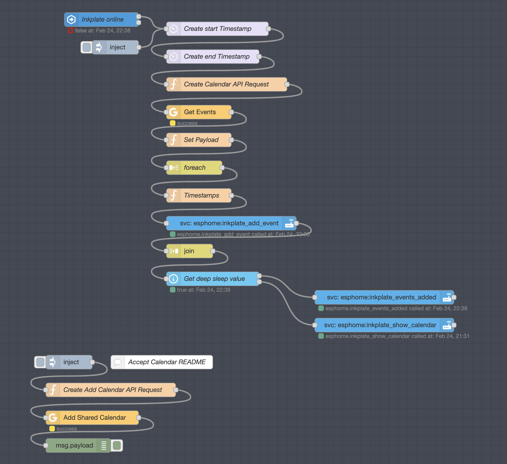

# ESPHome Inkplate6 Agenda

This combination of configuration files will set up node-red to pull your calendar events from Google Calendar
and push them to your Inkplate6 running ESPHome with the included [inkplate.yaml](inkplate.yaml).

## Warning

The YAML file uses configuration that is not merged into ESPHome
yet. It is for the touch pad interrupts to wake the inkplate on demand
for a forced data refresh or to OTA flash it.

## Basic flow of events

1. Inkplate wakes up from deep sleep
2. Once Home Assistant connected to the inkplate the Node-Red flow begins
3. The flow downloads the next 1 month worth of events from your Google Calendar
4. It then sends all of the non-private (see below) events to the inkplate via an ESPHome API [user defined service](https://esphome.io/components/api.html#user-defined-services)
5. Once all of the events have been sent, Node-Red sends calls another user defined service to:
    1. Update the battery level
    2. Redraw the screen with current event list
    3. Send the Inkplate6 into deep sleep for 1 hour

| Private calendar events: If yo

## Setup

### Inkplate6

1. Copy the [inkplate.yaml](inkplate.yaml) and [inkplate.h](inkplate.h) files into your ESPHome config directory. 
   This is `/config/esphome` if using ESPHome via the Home Assistant Supervisor.
2. Add/change the `!secret` keys to match your own
3. Compile and Upload

### Node Red

1. Create a service account on the [Google Developers Console](https://console.developers.google.com/apis/credentials) 
2. Create and download a new key for that service account in JSON format
3. Place the download json key as text into the Node Red configuration for Google
4. Share the Google Calendar with the email address for this service account
5. Change the `{Your calendar email address goes here}` values to the real calendar email address
6. Inject and run the smaller flow to accept the calendar share and verify in the debug output
7. Inject and run the main flow to verify it can fetch the calendar events with no errors (It might error if your inkplate is not set up/connected yet)

## Images

## Thanks

Thanks to [@jkmaxwell](https://github.com/jkmaxwell) and his [Family Calendar](https://github.com/jkmaxwell/Inkplate-ESPHome-Family-Calendar) 
for kicking me into gear to build mine. I got the basic layout and ideas from there and improved on the backend flow (I am no good with the actual design of the screen and layout). 
